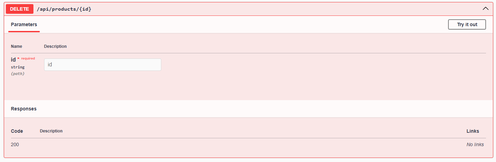

#Microservicios
Este proyecto es una aplicación de e-commerce desarrollada con NestJS, utilizando Prisma como ORM para la gestión de la base de datos. Se basa en una arquitectura de microservicios, lo que permite escalabilidad y modularidad.
##Tecnologias 
**NestJS:** Framework de Node.js para construir aplicaciones escalables y modulares.
**Prisma:** ORM para la interacción con la base de datos.
**PostgreSQL**: Base de datos relacional
**Docker:** Para despliegue y gestión de contenedores.
##Funcionalidades
**Gestión de Usuarios(users/):** registro, autenticación, actualización y eliminación.
**Módulo de Productos(products/):** Creación, edición y eliminación de productos en la tienda.
**Módulo de Categorías(categories/):** CRUD completo para organizar los productos según distintas categorías.
**Módulo de Reseñas(reviews/):** reseñas respecto a los distintos productos por parte de un usuario.
**Módulo de Favoritos(favorites/):** organización de productos favoritos para cada usuario.
**Gestión de deudas de clientes (customer-debts/):** Módulo para registrar y gestionar deudas asociadas a clientes.

## Instrucciones de Despliegue

```bash
#Instalacion de modulos
$ npm install

#Para generar el cliente prisma con sus respectivos modelos
$ npx prisma generate

#(Opcional en caso de querer hacer migraciones a la base de datos)
$ npx prisma migrate

# Compilar y ejecutar
$ npm run start

# Modo desarrollo
$ npm run start:dev

# Modo producción
$ npm run start:prod

#PARA DOCKER
docker compose up --build #Construye las imágenes y levanta los contenedores
docker compose down #Detiene y elimina los contenedores en ejecución
docker compose build #Construye las imágenes sin ejecutarlas

```
##ENDPOINTS
###Products

####Post Products

####Get Products

####Get Products by id

####Patch Products

####Delete Products

###Users

####Post Users

####Get Users

####Get Users by id

####Patch Users

####Delete Users

###Categories

####Post Categories

####Get Categories

####Get Categories by id

####Patch Categories

####Delete Categories
